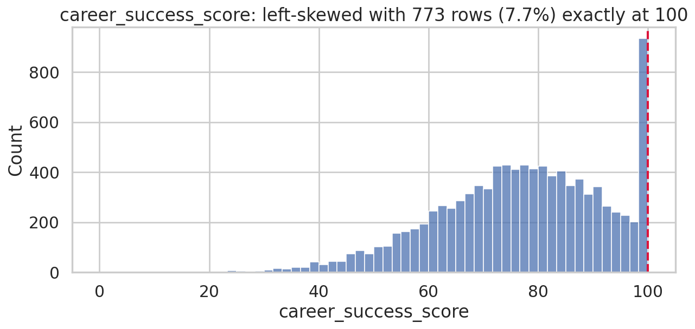
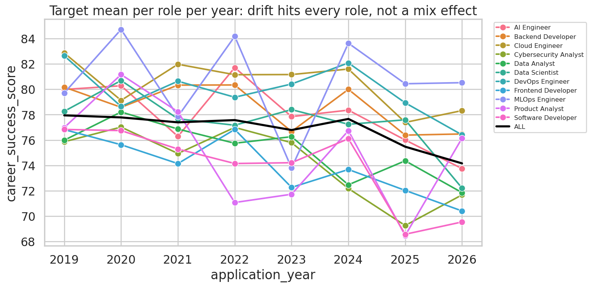
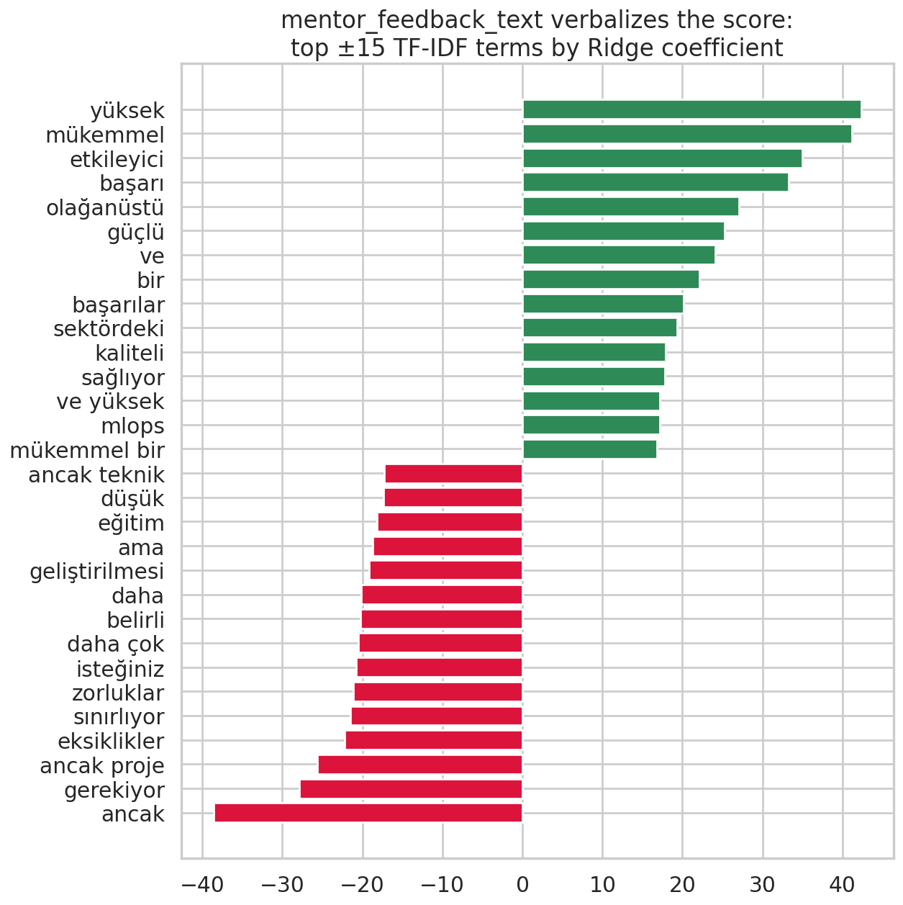
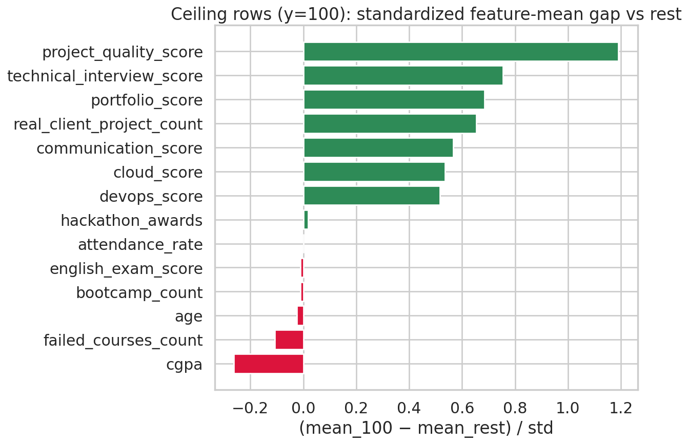
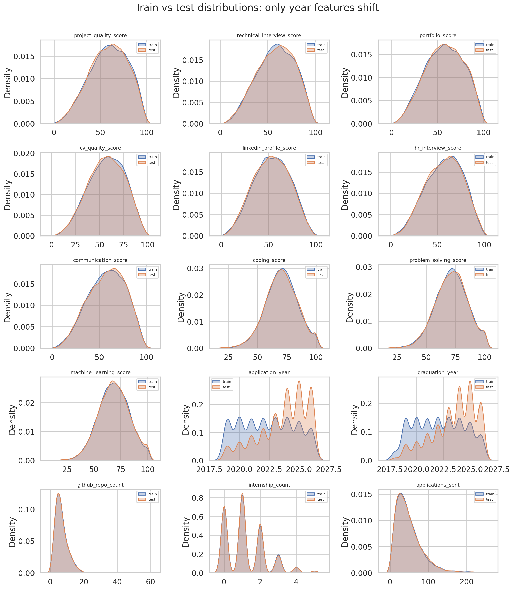
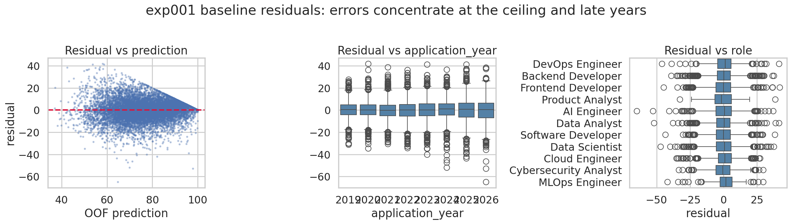
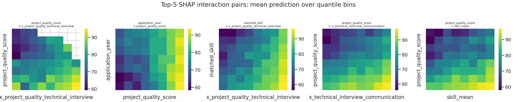
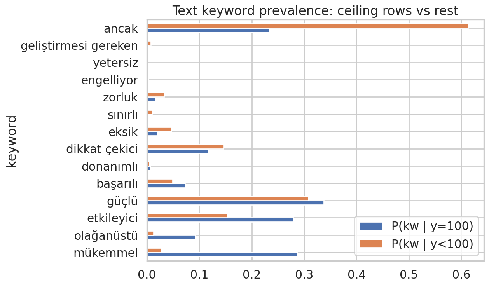

# BTK Datathon 2026 — Career Success Score Prediction

Predict `career_success_score` (continuous, 0–100) for 10,000 students from
40 numeric features, 5 categoricals, and a Turkish free-text mentor feedback field.
**Metric: MSE.** This repo is a full, reproducible experiment pipeline:
fixed 5-fold CV, leakage-safe OOF feature stacking, per-experiment artifacts and an
append-only results log.

## How to reproduce

```bash
pip install -r requirements.txt          # + torch/sentence-transformers/transformers for exp004+/009/011
python scripts/run_all.py                # runs every config in configs/, skips completed exp_ids
python scripts/blend.py                  # OOF-weight blend + ridge stacker over all artifacts
python scripts/make_submission.py -e blend
```

Single experiment: `python scripts/run_experiment.py -c configs/exp005.yaml`
(add `--hpo-trials 200` for Optuna tuning). Diagnostics:
`python scripts/adversarial_validation.py`, `python reports/eda/deep_eda.py`.

## Key findings

1. **The text verbalizes the score.** The Turkish `mentor_feedback_text` is LLM-generated
   and encodes the target: "mükemmel" → mean 91.8, "sınırlı" → 67.0. OOF TF-IDF
   ridge/logistic meta-features are the single biggest win (−5.5 CV MSE).
2. **Ceiling effect**: 7.7% of train has y=100 exactly; a P(y==100) classifier reaches
   AUC ~0.93. Two-stage blending helps (exp007), modestly once text meta is present.
3. **Covariate shift is temporal only**: adversarial AUC 0.65 with year features,
   0.52 without (verified: `scripts/adversarial_validation.py`). Test skews to 2024–2026,
   where target means are lower — `rmse_year_2024plus` is tracked for every run as the LB proxy.
   Naive year-reweighting of samples does NOT help (exp008).
4. **Missingness is signal**: NA rows score lower; per-column NA flags + row NA count
   are features, no imputation for GBMs.
5. **Top interaction** (SHAP): `application_year × project_quality_score` — the value of a
   strong project portfolio shifts across years.

## Results (CV, fixed 5-fold, seed 42 — see results.csv / EXPERIMENTS.md)

| exp | description | CV MSE | CV RMSE | 2024+ RMSE |
|---|---|---|---|---|
| exp001 | LGBM baseline, no FE | 85.05 | 9.22 | 10.27 |
| exp002 | + tabular FE | 83.97 | 9.16 | 10.19 |
| exp003 | + text features & TF-IDF meta | 78.51 | 8.86 | 9.84 |
| exp005 | CatBoost, same features | **76.25** | **8.73** | **9.75** |
| exp006 | XGBoost, same features | 79.00 | 8.89 | 9.89 |
| exp007 | two-stage ceiling model | 78.25 | 8.85 | 9.81 |
| exp008 | year-ratio sample weights | 79.33 | 8.91 | 9.86 |
| exp011 | torch MLP | 87.55 | 9.36 | 10.50 |
| **blend** | ridge stacker over all OOFs | **74.93** | **8.66** | **9.66** |

Embedding/BERT configs (exp004/009/010) require GPU + HuggingFace access — see
EXPERIMENTS.md "Pending". Current submission candidates: `sub_exp001` (anchor),
`sub_exp005` (best single), `sub_blend`.

## Figure gallery (`reports/figures/`, generated by `reports/eda/deep_eda.py`)

| | |
|---|---|
|  Left-skewed target with a hard ceiling at 100 (7.7%). |  The drop in late years hits every role → temporal drift, not role mix. |
|  TF-IDF terms by Ridge coefficient: the feedback text literally spells out the score. |  What makes a y=100 row: interview/project/portfolio scores, not GPA. |
|  Train-vs-test overlays: only year features shift. |  Baseline residuals concentrate at the ceiling and late years. |
|  Top-5 SHAP interaction pairs. |  Keyword prevalence: ceiling rows vs rest. |

## Repo layout

```
data/raw/            competition CSVs        data/processed/   folds.csv, caches
src/                 pipeline (data, cv, models, features/, hpo, two_stage)
configs/             one YAML per experiment (exp001–exp011)
scripts/             run_experiment, run_all, make_submission, blend, adversarial_validation
artifacts/           oof_/test_ predictions, params, importances per experiment
reports/eda|figures  committed EDA code + PNGs       submissions/  sub_*.csv
results.csv          append-only experiment log      EXPERIMENTS.md  curated log
```

## Protocol (non-negotiable)

- One fixed fold file (`data/processed/folds.csv`), stratified on target deciles, seed 42 — never re-split.
- Every fitted transform (TF-IDF, target encoding, kNN-target, scalers) fits inside the training fold only.
- All predictions clipped to [0, 100]; MSE and RMSE logged, plus year-sliced and non-ceiling RMSE.
- Every run appends to `results.csv` and persists `artifacts/{oof,test}_{exp}.npy` for stacking.
